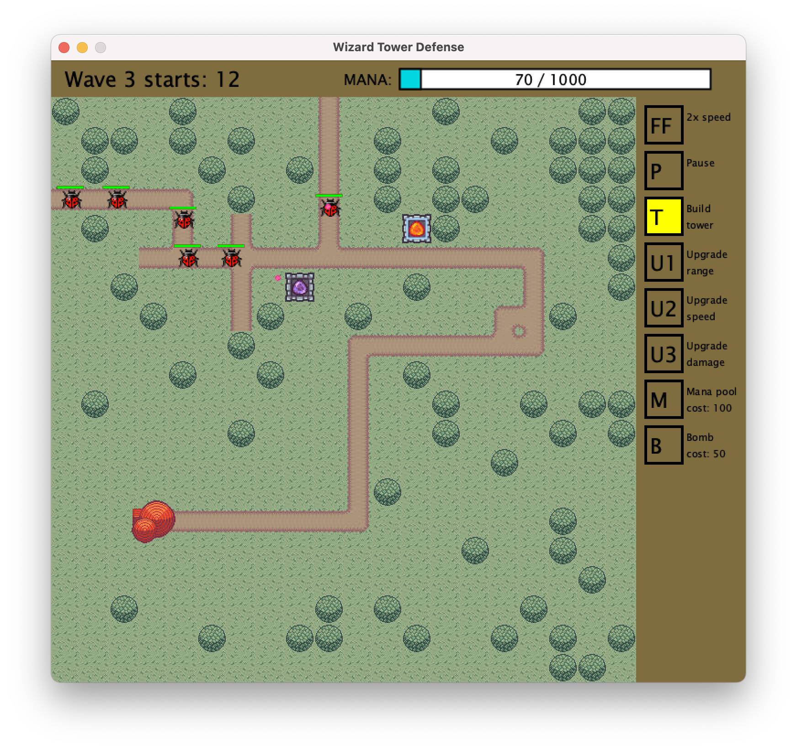

# Tower Defense Game
Tile-based tower defense game written in Java. Uses the Processing graphics library, Gradle for dependency management. Testcases written in JUnit.

Final assignment for an Object-Oriented Programming unit.

## Table of Contents

- [Usage](#usage)
- [Gameplay Screenshots](#gameplay-screenshots)

## Usage
To run the project, simply download all files in this repository excluding the "gameplay-screenshots" folder; save all downloaded files into a single folder; open this single folder in an IDE such as Visual Studio Code. Make sure Gradle is installed. Open a new terminal, and run the command `gradle run` to execute the program.

## Gameplay Screenshots

